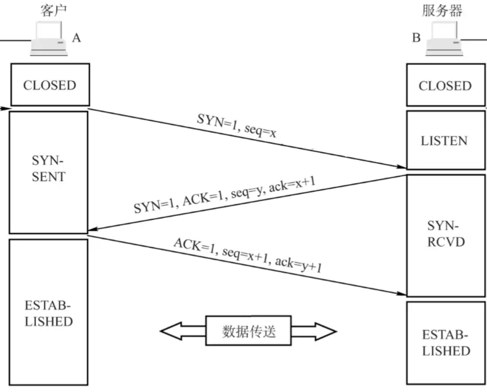
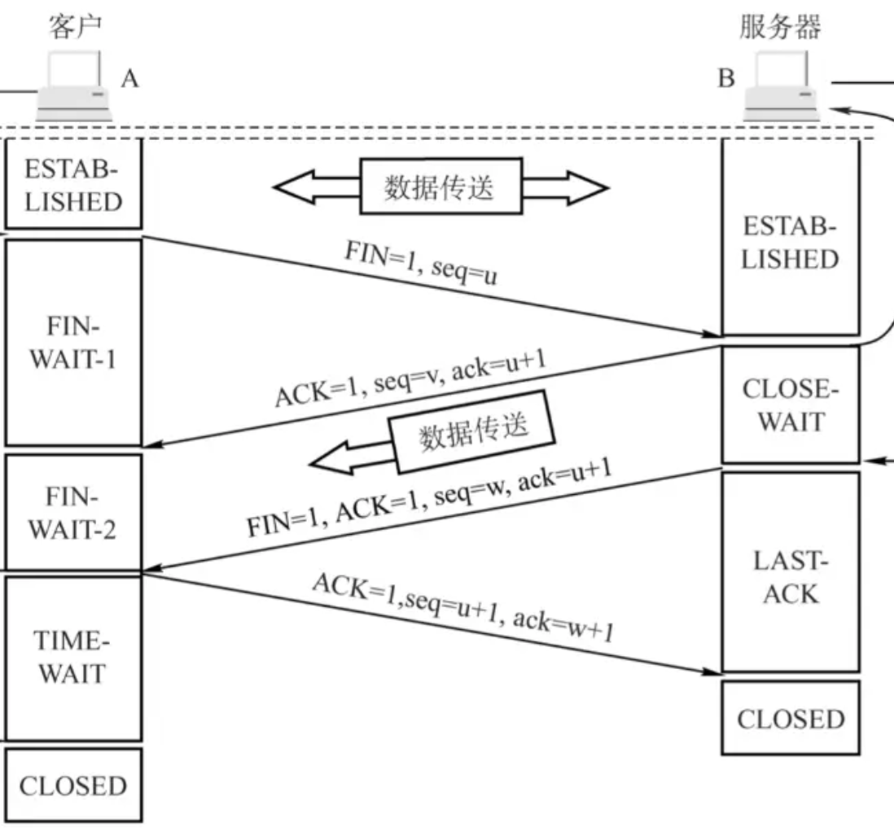

### 三次握手

客户端向服务器发送同步标志位和序列号x
然后服务器向客户端发送同步标志位，确认标志位，序列号y和确认号x+1
最后客户端向服务器发送确认标志位，序列号x+1，确认号y+1

 
 

### 四次挥手

客户端向服务器发送结束标志位，序列号x
然后服务器向客户端发送确认标志位，确认号x+1，序列号y
之后服务器向客户端发送结束标志位，确认号x+1，序列号z(中间可能传输了剩余数据，所以和 v 不同)
最好客户端向服务器发送确认标志位，确认号z+1,序列号x+1

**（1）TCP 队头阻塞成因**
TCP 基于全局字节序号的有序字节流，整条连接所有报文共用一套序号。一旦中间报文丢失，后续所有报文都需要等待重传，造成整条连接阻塞。

**（2）HTTP/2 为什么没根治？**
HTTP/2 仅在应用层实现多路复用，多条 HTTP 流仍共用同一条 TCP 连接，底层 TCP 的全局有序机制不变，因此依旧存在 TCP 层队头阻塞。

**（3）HTTP/3 (QUIC) 如何彻底解决？**
QUIC 基于 UDP 承载，抛弃 TCP 字节流模型，在应用层实现多流独立编号、独立重传。
不同流之间完全隔离，单个流丢包仅阻塞自身，不影响其他流，从底层彻底解决队头阻塞
