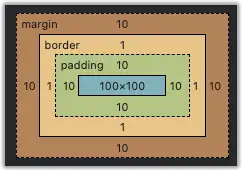

## 盒子模式

盒子模型（Box Model）是 CSS 中的一个核心概念，**用于描述元素的布局和空间占用**，<u>把元素看作盒子模型是为了更好地布局</u>

每个 HTML 元素在布局场景下都可以看作一个盒子，这个盒子包含了内容区域、内边距、边框和外边距：

- content
- padding
- border
- margin

上面这个div元素此时就是盒子模型，它的结构由内到外分别是：

content（100x100）
padding（10 * 4）
border（1* 4）
margin（10 * 4）