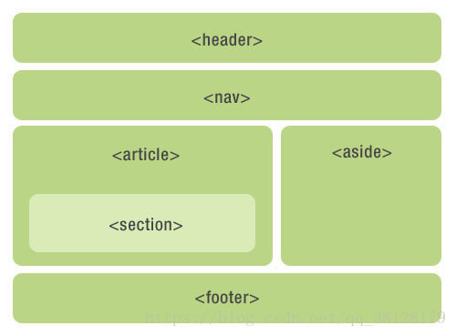

## 语义化标签

语义化标签的就是<u>让 HTML 文档从 “单纯承载视觉内容的容器”，变成 “带有清晰逻辑含义、可被机器和人共同理解的结构化文档”</u>，。实现了 **内容语义与样式的解耦**，语义化标签本身不附带固定的样式或行为。

特征
- **语义的明确性与单一性**：一个标准的语义化标签仅对应一类特定的内容属性或页面结构角色
- **结构的关联性**：语义化标签能清晰体现页面内容之间的层级、包含、主次关系
- **与样式的完全解耦**：语义化标签本身不规定任何视觉呈现效果，不会因标签类型固定字体、颜色、布局等样式。
- **标准化与兼容性**：语义化标签是 HTML 标准的一部分，被所有主流浏览器、解析引擎原生支持，无需额外的解析插件或兼容代码，是跨平台、跨设备的通用语义定义方式。
  
优点
- **提升代码的可读性与可维护性**：对于开发人员而言，无需查看额外的 class、id 属性或注释，仅通过标签本身就能**快速识别页面的结构划分和内容性质**，大幅 **降低代码的理解成本**
- **优化 SEO 与信息检索**：搜索引擎会 **依据语义化标签识别页面的核心区域**，精准判断内容的相关性和重要性，**让页面的核心信息能更准确地被检索到**，<u>提升页面在搜索结果中的权重和匹配度，从而提高搜索排名</u>
- **提升无障碍访问性**：辅助屏幕阅读器、语音识别等无障碍设备正确解读页面的内容结构和逻辑关系，**让残障用户能按内容的语义而非视觉布局浏览页面**，符合 Web 无障碍开发的规范。
- **规范 HTML 的编写逻辑**：避免开发者过度使用无语义容器标签，通过自定义属性定义内容含义的混乱写法，**让 HTML 文档的编写遵循统一的标准，提升代码的规范性和通用性。**

`<h1>~<h6>`元素
定义页面的 **标题**，h1元素具有最高等级，h6元素具有最低的等级

 

`<header>`元素
用于定义页面的 **介绍展示区域**，通常包括网站logo、主导航、全站链接以及搜索框。也适合对页面内部一组介绍性或导航性内容进行标记

 

`<nav>`元素
定义页面的 **导航链接部分区域**，不是所有的链接都需要包含在`<nav>`中，除了页脚再次显示顶级全局导航、或者包含招聘信息等重要链接。

 

`<main>`元素
定义页面的 **主要内容**，一个页面只能使用一次。如果是web应用，则包围其主要功能。

 

`<article>`元素
定义页面 **独立的内容**，<u>它可以有自己的header、footer、sections等</u>，专注于单个主题的博客文章，报纸文章或网页文章。article可以嵌套article，只要里面的article与外面的是部分与整体的关系。

 

`<section>`元素
用于 **标记文档的各个部分**，例如长表单文章的章节或主要部分。

 

`<aside>`元素
定义与主要内容相关的内容块。通常显示为 **侧边栏**。

 

`<footer>`元素
定义文档的 **底部区域**，通常包含文档的作者，著作权信息，链接的使用条款，联系信息等