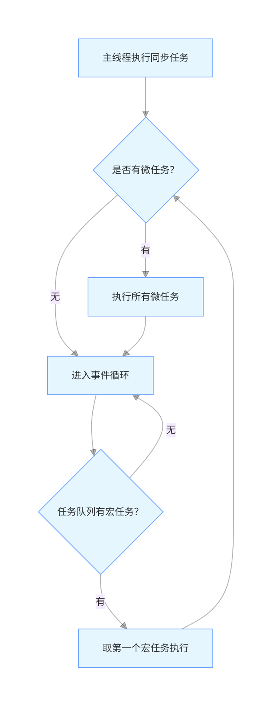

## 事件循环机制，单线程，微任务/宏任务

**JavaScript 语言本身是单线程的，但运行 JavaScript 的宿主环境（浏览器 / Node.js）是多线程的**
   - 主线程：只负责执行 JavaScript 的同步代码、以及异步任务的回调函数（这部分确实是单线程）。
   - **异步任务的 “耗时处理”：由宿主环境的其他线程（非 JS 主线程）完成**，比如浏览器的定时器线程、网络请求线程、DOM 事件线程等。
  
### JavaScript 特点
JavaScript 是 **单线程非阻塞** 的一门语言。
**单线程意味着**：JavaScript 代码在执行的时候只有一个主线程去处理所有的任务，即同一时间只能做一件事情。
**非阻塞则表示**：当执行到一项异步任务的时候，主线程会挂起当前这个异步任务，然后在异步任务返回结果的时候再跟进一定的规则去执行相应的回调。

###### **为什么 JavaScript 要设计成单线程？**
原因之一在其最初也是最主要的执行环境——浏览器中，我们需要进行各种各样的 DOM 操作。试想一下 如果 Javascript 是多线程的，那么当两个线程同时对 DOM 进行一项操作，例如一个向其添加事件，而另一个删除了这个 DOM，此时该如何处理呢？因此，为了保证不会 发生类似于这个例子中的情景，Javascript 选择只用一个主线程来执行代码，这样就 **保证了程序执行的一致性**

###### **为什么要搞 “异步”？**
如果所有任务都是同步的，遇到耗时操作（比如网络请求、定时器、DOM 事件），**主线程会被阻塞，页面就会卡死**（比如点击没反应、动画卡顿）

### 事件循环（Event Loop）

**JavaScript 通过事件循环实现非阻塞的。而事件循环是通过任务队列机制协调的**

事件循环是 JS 实现异步的底层机制，简单说就是 **主线程不断从任务队列里取任务执行** 的 **循环过程**，步骤如下：



1. 第一步：主线程先执行「执行栈」里的同步任务（比如变量声明、普通函数调用），执行完同步任务后清空执行栈；
2. 第二步：执行「微任务队列」里的所有微任务（注意是 “所有”，直到微任务队列为空）；
3. 第三步：进入「事件循环」，从「宏任务队列」里取第一个宏任务执行；
4. 第四步：执行完这个宏任务后，再次执行「微任务队列」里的所有微任务；
5. 重复步骤 3-4：循环往复，直到所有任务执行完毕。

### 微任务 vs 宏任务

异步任务被分成「微任务」和「宏任务」两类，优先级：微任务 > 宏任务

|类型	|优先级|	常见示例|
|:--|:--|:--|
|微任务|	高	|Promise.then/catch/finally、async/await（本质是 Promise）、queueMicrotask ()、MutationObserver|
|宏任务|	低	|setTimeout、setInterval、setImmediate（Node 环境）、I/O（网络 / 文件请求）、DOM 事件（click/load）、script 整体代码|

### 例子

**1. 基础嵌套：同步 + 微任务 + 宏任务**
```js
console.log('1.start');

setTimeout(() => {
  console.log('2.timeout1');
  Promise.resolve().then(() => {
    console.log('3.promise in timeout1');
  });
}, 0);

Promise.resolve().then(() => {
  console.log('4.promise1');
  setTimeout(() => {
    console.log('5.timeout2');
  }, 0);
});

console.log('6.end');
```

> 输出：
1
6 
4 
2 
3 
5

<br/>

**2. async/await + 微任务嵌套**

```js
console.log('1');

async function fn() {
  console.log('2');
  await Promise.resolve();
  console.log('5');
  await Promise.resolve().then(() => {
    console.log('6');
  });
  console.log('7');
}

fn();

Promise.resolve().then(() => {
  console.log('4');
});

console.log('3');
```

> 输出：
1
2
3
4
5
6
7
> 说明：
>  - async 函数调用时，会立刻执行函数内部的同步代码，直到遇到第一个 await:
>     - 先执行 await 后面的表达式（比如 Promise.resolve()）；
>     - 把 await 后面的代码（“等待后的代码”）推入微任务队列，然后暂停 async 函数执行，让出主线程；
>     - 只有等 await 后的 Promise 状态变为 resolved，且当前微任务队列清空后，才会执行 “等待后的代码”。

<br/>

**3. 多个宏任务 + 微任务插队**

```js
console.log('a');

setTimeout(() => {
  console.log('b');
  queueMicrotask(() => {
    console.log('c');
  });
}, 0);

setImmediate(() => { // 浏览器中可替换为setTimeout(()=>{},0)，Node环境直接运行
  console.log('d');
});

Promise.resolve().then(() => {
  console.log('e');
  setTimeout(() => {
    console.log('f');
  }, 0);
});

console.log('g');
```

> 输出：
a
g
e
b
c
d
f

<br/>

**4. 同步 + 微任务 + 宏任务 + DOM 事件**

```html
<!-- 复制到HTML文件中运行，点击页面空白处触发事件 -->
<!DOCTYPE html>
<html>
<body>
<script>
console.log('1. 同步代码');

// 宏任务：定时器
setTimeout(() => {
  console.log('4. 宏任务 - setTimeout');
}, 0);

// 微任务：Promise
Promise.resolve().then(() => {
  console.log('3. 微任务 - Promise');
});

// 宏任务：DOM事件（点击页面触发）
document.addEventListener('click', () => {
  console.log('5. 宏任务 - click事件');
  Promise.resolve().then(() => {
    console.log('6. 微任务 - click里的Promise');
  });
});

console.log('2. 同步代码');
</script>
</body>
</html>
```

> 输出：
1
2
3
4
5
6

<br/>

**5. 复杂嵌套：微任务里套宏任务，宏任务里套微任务**

```js
console.log('第一步');

const promise1 = new Promise((resolve) => {
  console.log('第二步');
  resolve();
  console.log('第三步');
});

promise1.then(() => {
  console.log('第六步');
  setTimeout(() => {
    console.log('第八步');
    Promise.resolve().then(() => {
      console.log('第九步');
    });
  }, 0);
});

setTimeout(() => {
  console.log('第七步');
  Promise.resolve().then(() => {
    console.log('第十步');
  });
}, 0);

console.log('第四步');

queueMicrotask(() => {
  console.log('第五步');
});
```

> 输出:
第一步
第二步
第三步
第四步
第五步
第六步
第七步
第十步
第八步
第九步
> 说明：
> then 回调的入队规则：Promise 状态确定（成功 / 失败） + 执行栈为空（同步代码完）
